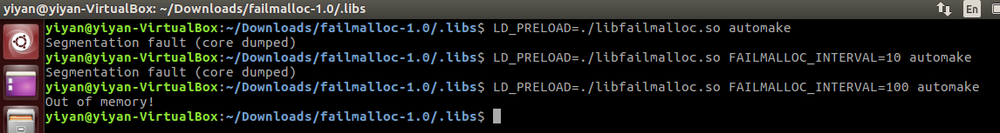
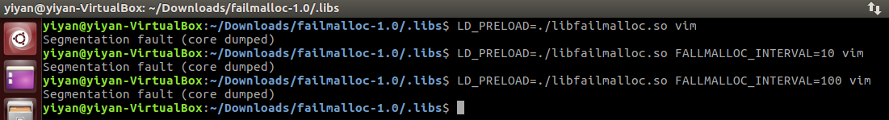

### CS4239 Lab 6

| Name        | Matriculation No.| Email  |
| ------------- |-------------| -----|
| Tan Yi Yan      | A0127051U | yiyan@u.nus.edu |

#### Exercise 1

##### Linux Programs with Error
I tried using `failmalloc` with different `FAILMALLOC_INTERVAL` (0, 10 and 100) to on some linux programs to discover how did the linux programs deal with the situation when memory allocations calls (such as `malloc`, `realloc` and `memalign`) fails to allocate memory. Through this, I discovered that *automake* and *vim* did not handle the failure condition properly and the failure to allocate memory in these programs led to segmentation fault.

**automake**  
The screenshot in Figure 1. shows that the results of using `failmalloc` on *automake*. As seen in the figure, *automake* did not properly handle the condition when memory allocation calls fails to allocate memory. In particular, *automake* did not handle the failure condition in the 1st and 10th memory allocation call. As a result, a segmentation fault happens when the memory allocation fails. However, on the 100th call, the failure condition was caught by *automake* - an error message "Out of memory!" was printed by *automake*.

*Figure.1 Results of using failmalloc on automake*

**vim**  
The screenshot in Figure 2. shows the results of using `failmalloc` on *vim*. It is evident from the screenshot that *vim* did not properly deal with the condition when memory allocation calls fails to allocate memory. More specifically, *vim* did not handle the failure condition in the 1st, 10th and 100th memory allocation call. As seen in the screenshot below, segmentation faults happen because *vim* did not catch the problem.

*Figure.1 Results of using failmalloc on vim*

##### LD_PRELOAD
`LD_PRELOAD` is an optional environment variable that allows us to specify one or more paths to shared libraries or objects for the loader to load before any other shared libraries. As a result of preloading a library, the functions in the preloaded library will be used before others of the same name in later libraries.

#### Exercise 2

> Read the code and clearly explain 3 of the bugs.

> Explain what bugs are found and how you found them. You should also give the input file(s) used and the exact failmalloc options to demonstrate the bug.

**Bug 1**  

**Bug 2**  

**Bug 3**  
