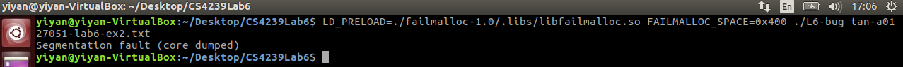

### CS4239 Lab 6

| Name        | Matriculation No.| Email  |
| ------------- |-------------| -----|
| Tan Yi Yan      | A0127051U | yiyan@u.nus.edu |

#### Exercise 1

##### Linux Programs with Error
I tried using `failmalloc` with different `FAILMALLOC_INTERVAL` (0, 10 and 100) to on some linux programs to discover how did the linux programs deal with the situation when memory allocations calls (such as `malloc`, `realloc` and `memalign`) fails to allocate memory. Through this, I discovered that *automake* and *vim* did not handle the failure condition properly and the failure to allocate memory in these programs led to segmentation fault.

**automake**  
The screenshot in Figure 1. shows that the results of using `failmalloc` on *automake*. As seen in the figure, *automake* did not properly handle the condition when memory allocation calls fails to allocate memory. In particular, *automake* did not handle the failure condition in the 1st and 10th memory allocation call. As a result, a segmentation fault happens when the memory allocation fails. However, on the 100th call, the failure condition was caught by *automake* - an error message "Out of memory!" was printed by *automake*.

*Figure 1. Results of using failmalloc on automake*

**vim**  
The screenshot in Figure 2. shows the results of using `failmalloc` on *vim*. It is evident from the screenshot that *vim* did not properly deal with the condition when memory allocation calls fails to allocate memory. More specifically, *vim* did not handle the failure condition in the 1st, 10th and 100th memory allocation call. As seen in the screenshot below, segmentation faults happen because *vim* did not catch the problem.

*Figure 2. Results of using failmalloc on vim*

##### LD_PRELOAD
`LD_PRELOAD` is an optional environment variable that allows us to specify one or more paths to shared libraries or objects for the loader to load before any other shared libraries. As a result of preloading a library, the functions in the preloaded library will be used before others of the same name in later libraries.

#### Exercise 2
**Bug 1**  
From inspecting the source code, it is evident that program is trying to print the contents of the input file line by line. It initialised a pointer `buf` to point to the memory allocated to store a line in the input file. The memory was allocated using `malloc` and there is a check to check if the memory allocation call succeeded so `failmalloc` should not be able to directly cause a segmentation fault at this memory allocation call. This memory block pointed by `buf` had an initial size of 128 bytes. However, a line in the input line may have more than 128 characters. Therefore, `realloc` is used to resize the memory block pointed to by `buf`. Unfortunately, the author of the program did not include checks to catch the failure condition of this memory allocation call (`realloc`).

As a result, I can cause a segmentation fault by using *tan-a0127051-lab6-ex2.txt* and limiting the memory that can be allocated successfully using `failmalloc`. *tan-a0127051-lab6-ex2.txt* is a file that contains a line of 129 characters. Therefore, the program will need to make the `realloc` call when *tan-a0127051-lab6-ex2.txt* is the input file. I made this `realloc` fail by limiting the memory that can be allocated successfully to 128 bytes by using the option `FAILMALLOC_SPACE=0x400`. As seen in Figure 3, this results in a segmentation fault because the `realloc` attempted to allocate a memory block that is at least 256 bytes but failed to do so due to the memory allocation limit set using the `failmalloc` option.

*Figure 3. Bug 1*

 
**Bug 2**  
The implementation of `fopen()` on my machine appears to make at least one memory allocation call and the author did not include checks for this memory allocation call. As a result, the program crashes when this memory allocation call fails. This can be achieved by using an arbitrary file (I just used *tan-a0127051-lab6-ex2.txt*) and using the `FAILMALLOC_TIMES=1` option to fail the memory allocation calls exactly once. This memory allocation call was made by `fopen()`. As seen in Figure 4., a segmentation faults happens.

*Figure 4. Bug 2*

**Bug 3**  
Another problem the program had is the lack of checks if the `fopen()` function succeeded in opening the input file. In this program, `fopen()` can fail to open the input file when the user executing the program does not have read permissions for the input file or when the input file does not exists. I will be demonstrating the latter. As seen in Figure 5., the input file name I used was *asd.txt* which is a file that does not exists on my machine. As a result, the `FILE` pointer, `F` is `NULL` after `fopen()`. When the program try to `fgetc()` using the `F` pointer, a segmentation fault occurs.

*Figure 5. Bug 3*
